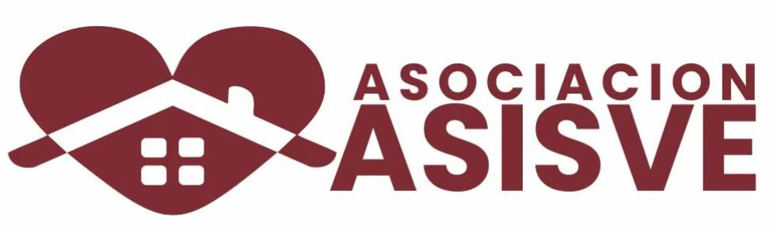
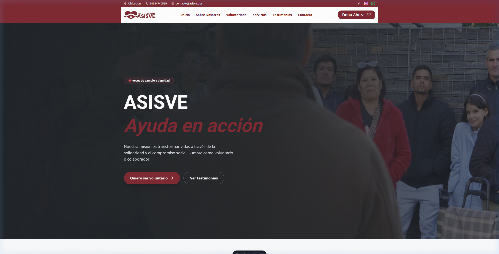
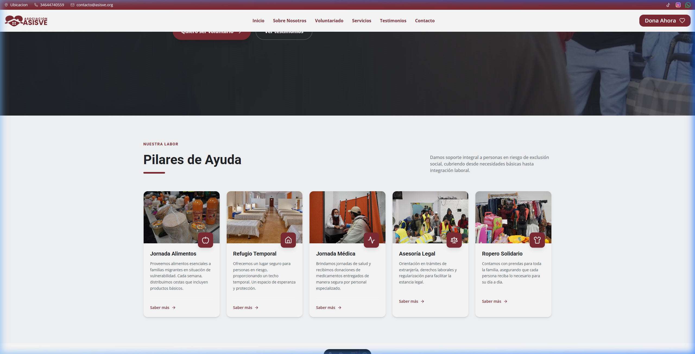

<div align="center">
  
  <h1>ASISVE - Voces de cambio y dignidad</h1>
  <p><strong>Plataforma Solidaria para la Inclusión Social y el Apoyo al Migrante</strong></p>

  <a href="https://asisve.org">Sitio Web</a> •
  <a href="/contact">Contacto</a> •
  <a href="/voluntariado">Voluntariado</a>
</div>

---

## 🌟 Descripción del Proyecto

**ASISVE** (Ayuda en Acción) es una plataforma web desarrollada con tecnologías modernas para facilitar la gestión de servicios sociales, la captación de voluntarios y la visibilidad de testimonios de impacto real. Nuestra misión es transformar vidas a través de la solidaridad y el compromiso social, ofreciendo un soporte integral a personas en riesgo de exclusión social.

Este repositorio contiene el código fuente de la aplicación web oficial, diseñada para ser rápida, accesible y fácil de mantener.

## 📸 Vista Previa

| Hero Section (Portada) | Pilares de Ayuda |
| :--- | :--- |
|  |  |

## 🚀 Características Principales

- **⚡ Arquitectura Moderna**: Construido con **Astro 6** para un rendimiento óptimo con carga mínima de JavaScript.
- **🎨 Diseño UI/UX Premium**: Interfaz moderna utilizando **Tailwind CSS 4**, con efectos de glassmorphism, micro-animaciones y diseño totalmente adaptativo (Mobile First).
- **📋 Pilares de Ayuda**: Sistema modular de servicios que incluye:
  - Distribución de Alimentos Esenciales.
  - Refugio Temporal y Acogida.
  - Jornadas Médicas y Donación de Medicamentos.
  - Asesoría Legal y Extranjería.
  - Ropero Solidario.
- **📩 Integración de Contacto**: Formulario de contacto avanzado con validación y backend integrado en **PHP** para una gestión robusta de mensajes.
- **📱 Social Ready**: Integración con feed de Instagram, mapa de ubicación interactivo y carrusel de colaboradores.
- **🌍 SEO Optimizado**: Meta tags dinámicos, estructura semántica HTML5 y optimización de imágenes.

## 🛠️ Stack Tecnológico

- **Core**: [Astro 6.0](https://astro.build/)
- **Estilos**: [Tailwind CSS 4.0](https://tailwindcss.com/)
- **Iconografía**: [Lucide Astro](https://lucide.dev/)
- **Backend API**: [PHP 8.x](https://www.php.net/) (Hosting compatible con Piensa Solutions)
- **Tipografía**: Outfit (via Google Fonts)
- **Scripts**: TypeScript

## 📁 Estructura del Proyecto

```text
/
├── assets/          # Imágenes de documentación y marketing
├── public/          # Activos estáticos (imágenes de la web, favicon)
│   └── api/         # Backend PHP para formularios y lógica de servidor
├── src/
│   ├── components/  # Componentes reutilizables (Navbar, Footer, Cards)
│   ├── layouts/     # Plantillas base de la aplicación
│   └── pages/       # Rutas y páginas principales (.astro)
├── .env.example     # Plantilla de variables de entorno
└── astro.config.mjs # Configuración principal de Astro
```

## 💻 Instalación y Desarrollo

1. **Clonar el repositorio**
   ```bash
   git clone https://github.com/usuario/asisve-astro.git
   cd asisve-astro
   ```

2. **Instalar dependencias**
   ```bash
   npm install
   ```

3. **Iniciar el servidor de desarrollo**
   ```bash
   npm run dev
   ```
   La aplicación estará disponible en `http://localhost:4321`.

## 🚢 Despliegue

La web está optimizada para desplegarse como un sitio estático con soporte para API PHP.

1. **Compilar para producción**:
   ```bash
   npm run build
   ```
2. **Subida al servidor**:
   Sube el contenido de la carpeta `dist/` a tu servidor. Asegúrate de configurar las variables de entorno para el envío de correos en el servidor PHP.

## 📍 Ubicación y Contacto

- **Dirección**: C. de Fuentelviejo, 37, San Blas, 28022 Madrid
- **Teléfono**: [+34 644 740 559](tel:+34644740559)
- **Email**: [contacto@asisve.org](mailto:contacto@asisve.org)

---

<div align="center">
  <p>Hecho con ❤️ por el equipo de ASISVE</p>
  <p><i>"Voces de cambio y dignidad"</i></p>
</div>